# DSA Visualizer — Sorting & Searching Algorithms

An animated, console based visualiser for the classic sorting and searching algorithms,
written from scratch in standard C++.

Every comparison, every swap and every recursive call is drawn on screen as a colour
coded bar chart, while a live statistics panel counts the work being done. Nothing is
sorted or searched by the standard library — all seven algorithms are hand written.

> **Minor Project** — C, C++ with DSA Program (InternsElite)
> Mentor: Alok Maddheshiya

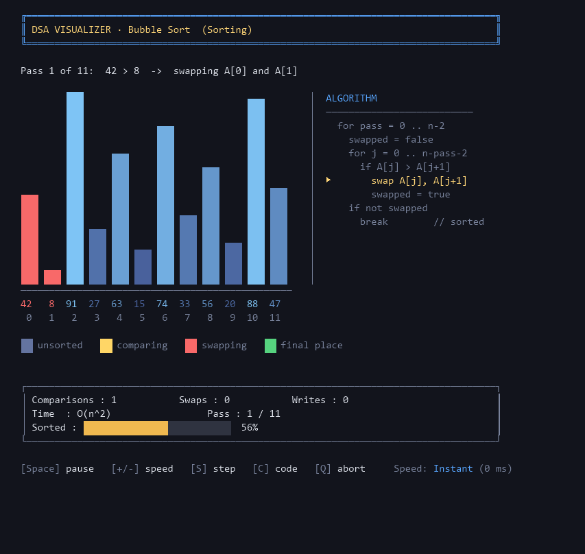

---

## Table of Contents

- [Project Description](#project-description)
- [Algorithms Implemented](#algorithms-implemented)
- [Features](#features)
- [Bonus Features](#bonus-features)
- [Technologies Used](#technologies-used)
- [OOP Concepts Used](#oop-concepts-used)
- [Steps to Run the Project](#steps-to-run-the-project)
- [Controls](#controls)
- [Sample Output Screenshots](#sample-output-screenshots)
- [How Correctness Is Verified](#how-correctness-is-verified)
- [Project Structure](#project-structure)
- [Design Notes](#design-notes)

---

## Project Description

Reading that Bubble Sort is `O(n²)` and *seeing* 60 comparisons crawl across a bar chart
are two different kinds of understanding. This project is built for the second kind.

You give it an array — typed in by hand, or generated as a random / sorted / reversed /
nearly sorted test case — pick an algorithm, and watch it run. The display shows:

- **the array as a bar chart**, with each bar coloured by the role it is playing right
  now: being compared, being swapped, acting as a pivot, already in its final place,
  or ruled out of a search;
- **the algorithm's own pseudocode, beside the chart, with the executing line lit up**,
  so you can see which line of code is causing the movement you are watching;
- **a status line in plain English** describing the exact step being taken, e.g.
  `Pass 3 of 11:  A[4]=63 > key 27  ->  shifting it right into index 5`;
- **a live statistics panel** counting comparisons, swaps, array writes, the current
  pass, and — for the recursive algorithms — the current and maximum recursion depth;
- **a live "sortedness" meter** measuring how much disorder is left in the array;
- **the time complexity** of the running algorithm, on screen the whole time.

When the run finishes you get a full report: the input, the output, a verification that
the result really is sorted, the final operation counts, the measured execution time,
and the best / average / worst case complexity.

The animation can be paused, sped up, slowed down, single stepped one frame at a time,
or abandoned mid run — and the results are still computed correctly if you abandon it.

---

## Algorithms Implemented

### Sorting

| Algorithm | Best | Average | Worst | Space | Stable | Technique |
|---|---|---|---|---|---|---|
| **Bubble Sort** | `O(n)` | `O(n²)` | `O(n²)` | `O(1)` | Yes | Adjacent swaps, with early exit when a pass makes no swap |
| **Selection Sort** | `O(n²)` | `O(n²)` | `O(n²)` | `O(1)` | No | Select the minimum of the unsorted part, one swap per pass |
| **Insertion Sort** | `O(n)` | `O(n²)` | `O(n²)` | `O(1)` | Yes | Grow a sorted prefix, shifting larger elements right |
| **Merge Sort** | `O(n log n)` | `O(n log n)` | `O(n log n)` | `O(n)` | Yes | **Recursive** divide and conquer |
| **Quick Sort** | `O(n log n)` | `O(n log n)` | `O(n²)` | `O(log n)` | No | **Recursive**, Lomuto partition, last element as pivot |

### Searching

| Algorithm | Best | Average | Worst | Space | Requires |
|---|---|---|---|---|---|
| **Linear Search** | `O(1)` | `O(n)` | `O(n)` | `O(1)` | Any array |
| **Binary Search** | `O(1)` | `O(log n)` | `O(log n)` | `O(log n)` | A **sorted** array |

Binary Search is written recursively, which is why its space cost is `O(log n)` (the call
stack) rather than the `O(1)` of an iterative version — the program says so on screen
rather than quoting the textbook number.

---

## Features

### User Input
- **Enter custom array elements** — type `42 8 91 27` (spaces or commas both work).
- **Generate random arrays** — plus sorted, reverse sorted and nearly sorted generators,
  so you can drive each algorithm into its best and worst case on purpose.
- **Select algorithms from a menu** — a full menu driven interface throughout.

### Visualisation
- **Step by step execution** of every algorithm, drawn as an animated bar chart.
- **Comparisons** highlighted in yellow as they happen.
- **Swaps** highlighted in red, shown before *and* after the exchange so you can see
  the two bars trade places.
- **Current iteration / pass** shown in the statistics panel and named in the status line.
- **Time complexity** displayed on screen for the whole run.

### Additional
- **Total comparisons, swaps and array writes**, counted exactly.
- **Execution time**, measured properly (see [Design Notes](#design-notes)).
- **Proper menu driven interface** — every screen is reachable and every screen has a
  way back.
- **Input validation everywhere** — non numeric input, out of range values, empty input,
  too many values, invalid menu options and a closed input stream are all handled without
  ever crashing or looping forever.

---

## Bonus Features

All four optional bonus features from the project brief are implemented, plus several more:

| Bonus feature | Where to find it |
|---|---|
| **Graphical bars visualisation** | Every algorithm run — colour coded, with value and index labels |
| **Speed control** | `Settings → Animation speed`, six presets, or `+` / `-` live during an animation |
| **Complexity comparison chart** | Main menu option 4 — a full big-O table plus a log scaled growth chart |
| **Dark / Light mode UI** | `Settings → Toggle dark / light theme`, applied to every screen |

Extras beyond the brief:

- **Live pseudocode panel** — each algorithm's own pseudocode is printed beside the
  chart and the executing line is marked and highlighted, frame by frame. The code and
  the bars tell the same story at the same instant. Toggle with <kbd>C</kbd>.
- **Sortedness meter** — a live bar showing how close the array is to sorted, measured
  by counting *inversions* rather than steps completed. Bubble Sort creeps up it
  steadily; Quick Sort jumps in steps as each pivot lands. See
  [Design Notes](#design-notes) for why this is the honest way to measure progress.
- **Half-block bar resolution** — bars are drawn to half-cell precision using `▄`,
  doubling the vertical resolution so two nearly equal values look different rather
  than identical.
- **Height-shaded bars** — idle bars are shaded along a gradient by value, which makes
  the shape of the data readable at a glance while leaving the bright role colours to
  carry the meaning.
- **Animated title screen** — a block-letter reveal with a travelling highlight.
- **Benchmark mode** — races all five sorts on the *same* randomly generated array (up to
  2000 elements) and reports comparisons, swaps and measured time side by side, with
  relative bar charts. At `n = 500` the gap between `O(n²)` and `O(n log n)` becomes
  impossible to miss.
- **Step mode** — advance the animation one frame per key press, for when you want to
  study a single partition or merge.
- **Pause / resume / abort** mid animation.
- **Unicode / ASCII toggle** — falls back to `#` and `+` bars for terminals or fonts that
  cannot render block characters.
- **Recursion depth tracking** for Merge Sort, Quick Sort and Binary Search.
- **Unsorted input guard** — Binary Search refuses to run on an unsorted array and offers
  to sort it first, rather than silently returning a wrong answer.

---

## Technologies Used

| | |
|---|---|
| **Language** | Standard C++ (C++11 / C++14) |
| **Standard library** | `<vector>`, `<string>`, `<memory>`, `<algorithm>`, `<random>`, `<chrono>`, `<sstream>`, `<iomanip>`, `<functional>`, `<cmath>` |
| **Paradigm** | Object oriented — classes, inheritance, polymorphism, encapsulation, RAII |
| **Visualisation** | Console based, using ANSI/VT escape sequences for 24 bit colour and flicker free redraw |
| **Platform layer** | Win32 (`windows.h`, `conio.h`) on Windows; `termios` / `select` on Linux and macOS — both behind one `Console` class |
| **Compiler tested** | MinGW g++ 6.3.0 on Windows 11 |
| **Build system** | None needed — one translation unit, one command |

The STL is used for containers, random number generation and timing. It is **never** used
to do the actual sorting or searching: there is no `std::sort`, no `std::find`, no
`std::binary_search` anywhere in the program. Even the "sort the array for me" menu action
runs this project's own Merge Sort.

---

## OOP Concepts Used

| Concept | Where |
|---|---|
| **Classes & Objects** | `Console`, `Theme`, `Statistics`, `Visualizer`, `RoleMap`, `InputReader`, `Algorithm`, `DsaVisualizerApp` and the seven algorithm classes |
| **Encapsulation** | Every class keeps its state `private` and exposes it through member functions — e.g. `Statistics` can only be changed through `countComparison()` / `countSwap()`, which is why the counts cannot drift |
| **Inheritance** | `Algorithm` → `SortingAlgorithm` → `BubbleSort` / `SelectionSort` / `InsertionSort` / `MergeSort` / `QuickSort`, and `Algorithm` → `SearchingAlgorithm` → `LinearSearch` / `BinarySearch` |
| **Polymorphism** | The menu holds `unique_ptr<SortingAlgorithm>` and calls virtual `name()`, `complexity()`, `description()`, `legend()` and `sort()` without knowing which algorithm it has |
| **Abstraction** | `Algorithm` is a pure virtual interface; `sort()` and `search()` are pure virtual |
| **Composition** | `Visualizer` holds a `Theme`; every `Algorithm` holds a `Statistics` |
| **Template method pattern** | `SortingAlgorithm::run()` fixes the sequence — animate, verify, re-run silently, time it — while each subclass supplies only its own `sort()` body |
| **RAII** | `ConsoleGuard` restores the terminal on *every* exit path, including exceptions; `unique_ptr` owns the algorithm objects |
| **Templates** | `Algorithm::animate()` takes any callable, so frame drawing is skipped entirely on silent runs |
| **Exceptions** | `AbortVisualization` unwinds cleanly out of deep recursion when the user presses `Q`; `ExitApplication` handles a closed input stream |

---

## Steps to Run the Project

### Requirements

- A C++ compiler supporting C++11 or later (g++, clang++ or MSVC).
- A terminal that supports ANSI colour. On Windows 10/11 this means **Windows Terminal**
  (the default), PowerShell or `cmd.exe` — all are fine. The program enables colour mode
  itself; no configuration is needed.

### Windows (MinGW / g++)

```bash
g++ -std=c++14 -O2 main.cpp -o dsa_visualizer.exe
dsa_visualizer.exe
```

### Windows (MSVC, from a Developer Command Prompt)

```bat
cl /EHsc /std:c++14 /O2 main.cpp /Fe:dsa_visualizer.exe
dsa_visualizer.exe
```

### Linux / macOS

```bash
g++ -std=c++14 -O2 main.cpp -o dsa_visualizer
./dsa_visualizer
```

That is the whole build — one file, one command, no libraries to install and no makefile.

### First run

1. Press <kbd>Enter</kbd> at the welcome screen.
2. Choose **3 — Array Setup** to type your own array, or just use the random one it
   starts with.
3. Choose **1 — Sorting Algorithms**, then pick an algorithm and watch it run.
4. Press <kbd>S</kbd> during the animation to step through it one frame at a time.

> **Tip:** maximise the terminal window before running. The visualiser adapts to whatever
> size it gets, but it looks best at 110 × 42 characters or larger. On Windows it tries to
> resize the console for you.

---

## Controls

Available at any point **during an animation**:

| Key | Action |
|---|---|
| <kbd>Space</kbd> | Pause / resume |
| <kbd>+</kbd> / <kbd>-</kbd> | Speed up / slow down |
| <kbd>S</kbd> | Toggle step mode — one frame per key press |
| <kbd>C</kbd> | Show / hide the live pseudocode panel |
| <kbd>Q</kbd> | Abort the animation (results are still computed and reported) |

Six speed presets are available: Very Slow (700 ms), Slow (330 ms), Normal (150 ms),
Fast (65 ms), Very Fast (22 ms) and Instant (0 ms).

---

## Sample Output Screenshots

### Title screen

Revealed a column at a time, with a highlight that travels across the letters.

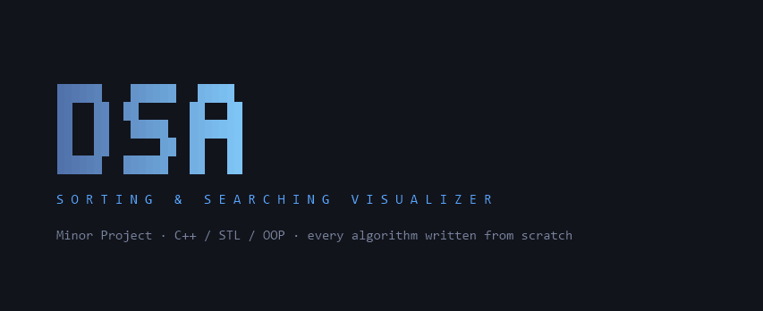

### Main menu

The working array is always visible, along with whether it is currently sorted.

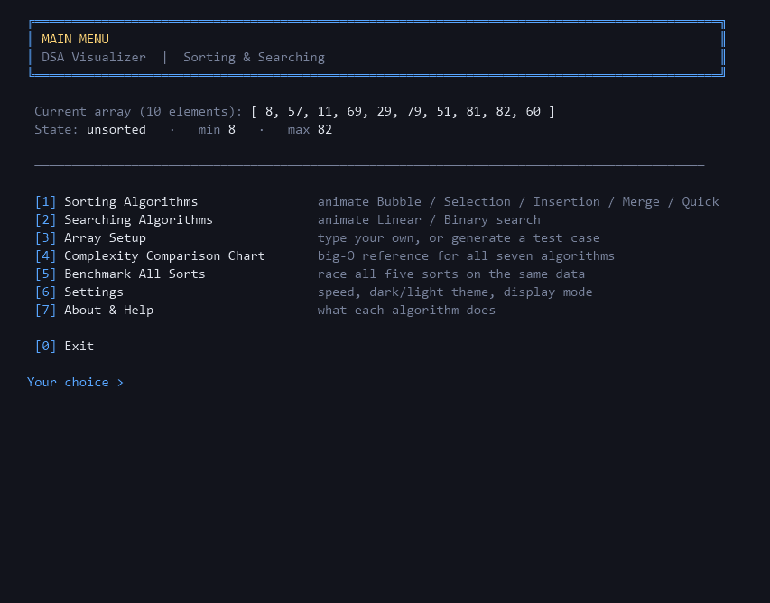

### Bubble Sort — a swap in progress

The two bars being exchanged are red, and the pseudocode panel on the right marks
`swap A[j], A[j+1]` as the line responsible. Idle bars are shaded by height; the
`Sorted` meter shows how much disorder is left.


### Merge Sort — merging two halves

The sub array currently being merged is picked out from the rest of the array, the front
of each half is highlighted, and the panel tracks the recursion depth.

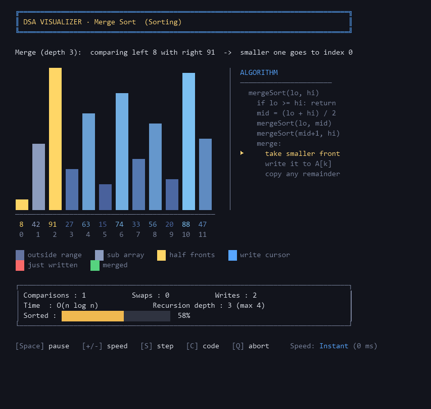

### Quick Sort — partitioning around a pivot

The pivot is purple, the current partition is lifted out of the background, and each
pivot that reaches its final position stays green for the rest of the run.

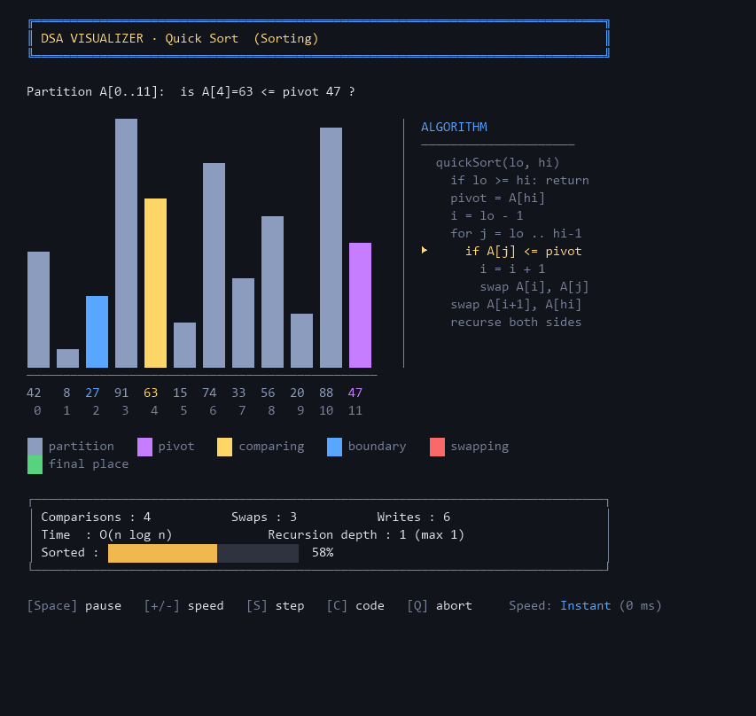

### Binary Search — halving the range

Eliminated elements fade into the background, so the search range visibly halves at each
step. The status line shows `low`, `high`, `mid` and the comparison being made.

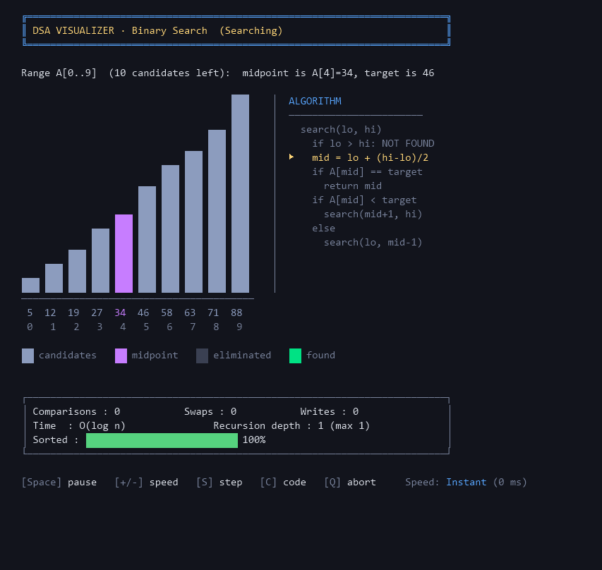

### Linear Search — target not present

Checked elements are greyed out one by one; the failure case is worth watching too.

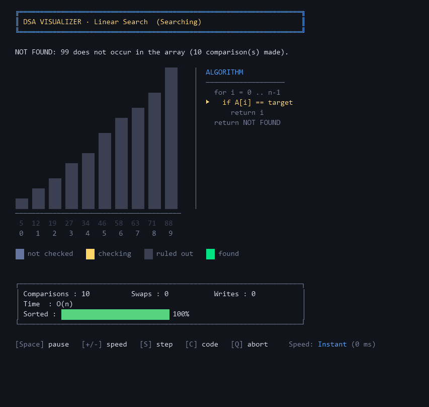

### Result report

Shown after every run: input, output, a correctness check, exact operation counts,
measured execution time, and the full complexity profile.

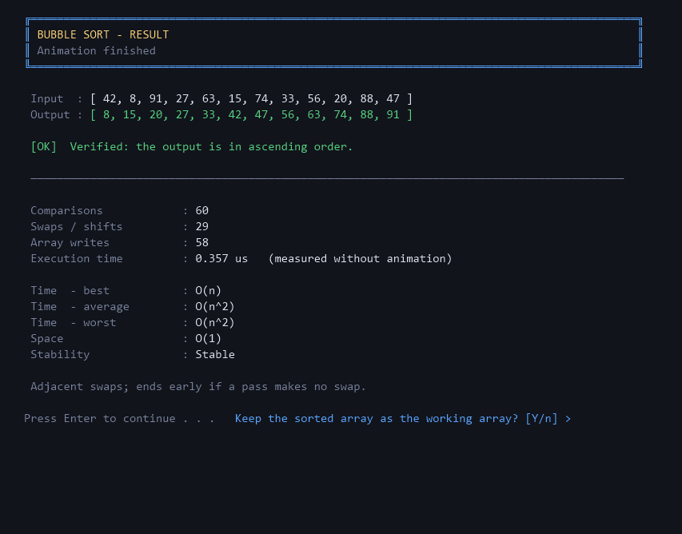

### Complexity comparison chart

A big-O reference for all seven algorithms, plus a log scaled chart of how the work grows
as `n` increases.

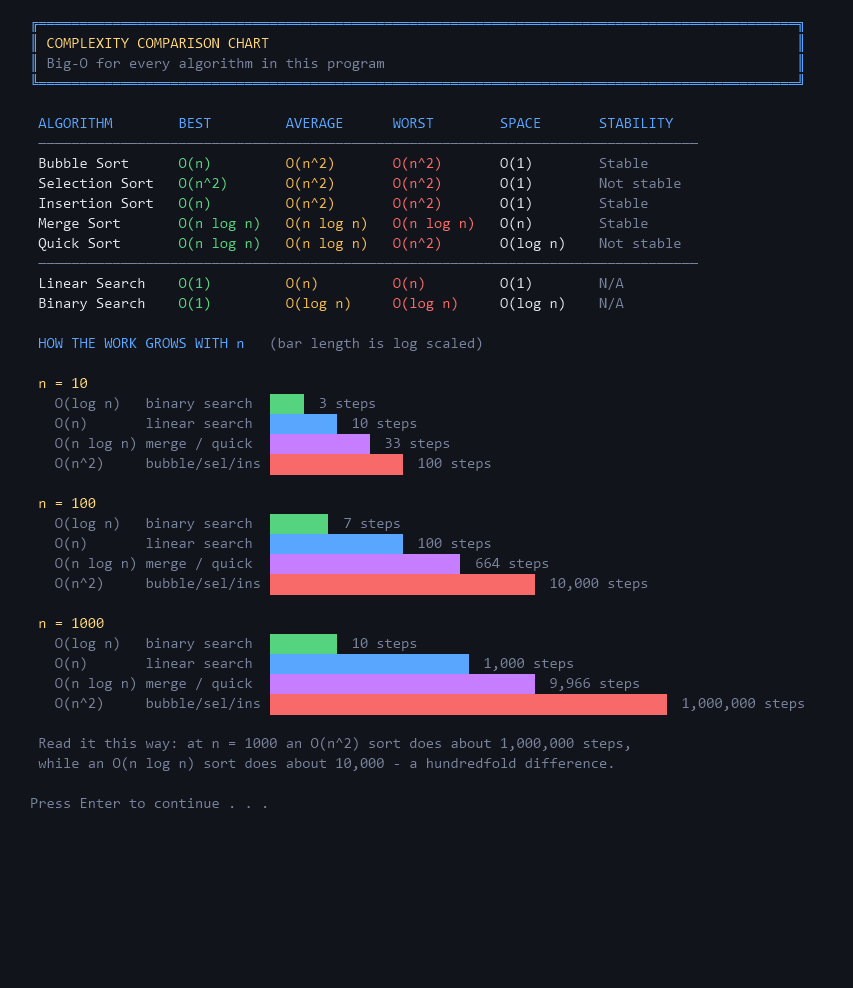

### Benchmark — all five sorts on identical data

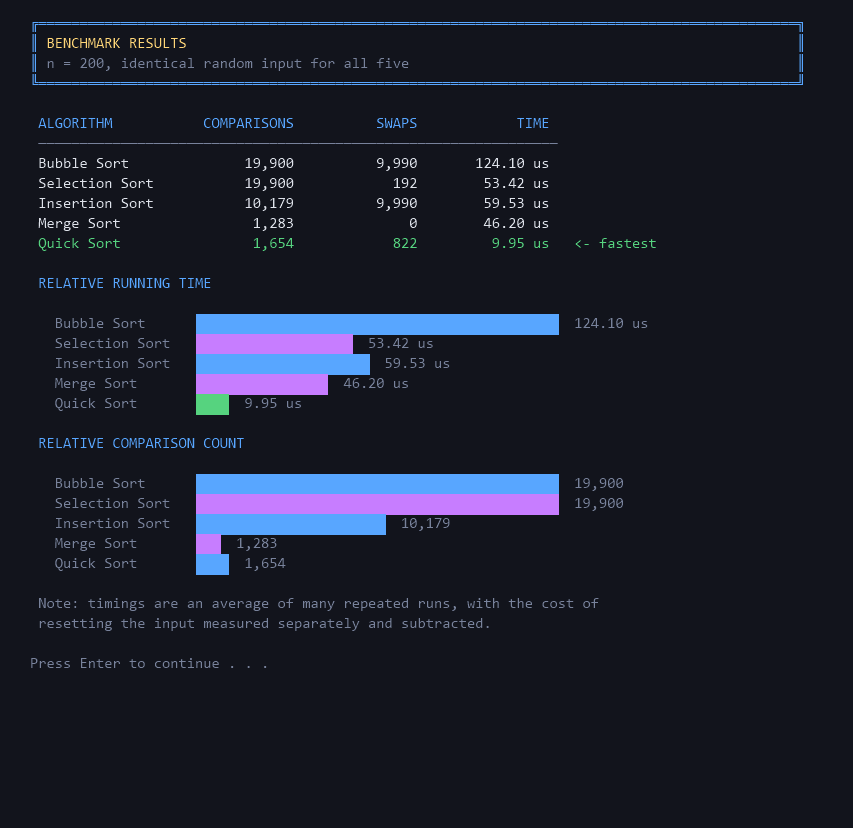

Two things worth noticing in this run at `n = 200`:

- **Bubble Sort and Insertion Sort report the same swap count** (9,316). That is not a
  coincidence — both counts equal the number of inversions in the input, which is a good
  independent check that the counters are correct.
- **Selection Sort makes 19,900 comparisons**, which is exactly `200 × 199 / 2`. Selection
  Sort's comparison count never depends on the data, and the program reproduces that
  exactly.

### Light theme

The theme applies to every screen, not just the bars.

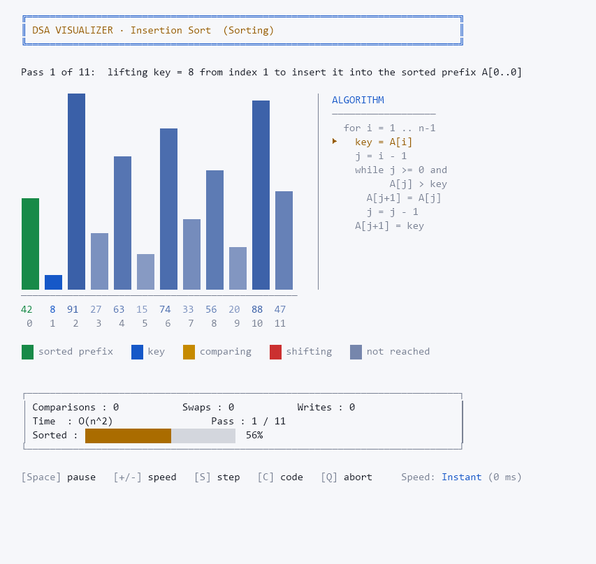

---

## How Correctness Is Verified

Rather than assuming the algorithms are right, the program checks:

- **Every sort is verified.** After each run the output is checked to be in ascending
  order, and the result screen says so explicitly. A failure would be reported as a bug
  rather than hidden.
- **The benchmark verifies every algorithm it times**, and prints a warning if any of them
  produces an unsorted result.
- **Aborting an animation does not corrupt anything.** If you press `Q` half way through,
  the array is restored and the sort is re-run silently, so the reported output and counts
  are always complete and correct.

The operation counts were also checked by hand. For the input `[5, 3, 9, 1, 7, 2, 8]`:

| Algorithm | Comparisons | Swaps / shifts | Notes |
|---|---|---|---|
| Bubble Sort | 20 | 10 | Stops after pass 5 of 6 — the early exit works |
| Selection Sort | 21 | 4 | 21 = 7 × 6 / 2, exactly as theory requires |
| Insertion Sort | 14 | 10 | Same shift count as Bubble's swap count (both = inversions) |
| Merge Sort | 14 | 0 | 20 array writes = the sum of every merged sub array length |
| Quick Sort | 13 | 10 | Maximum recursion depth 4 |

---

## Project Structure

```
.
├── main.cpp          the entire program (~2,900 lines, 18 classes)
├── README.md         this file
├── screenshots/      sample output
└── .gitignore
```

`main.cpp` is organised into ten commented sections:

| Section | Contents |
|---|---|
| 0 | Global limits and small string utilities |
| 1 | `Console` — the platform layer (all OS specific code lives here and nowhere else) |
| 2 | `Theme` — the dark / light palettes and the glyph sets |
| 3 | `InputReader` — validated input |
| 4 | `Statistics` — the operation counters |
| 5 | `Visualizer` — the drawing engine, speed control and interactive keys |
| 6 | `Algorithm` / `SortingAlgorithm` / `SearchingAlgorithm` — the class hierarchy |
| 7 | The five sorting algorithms |
| 8 | The two searching algorithms |
| 9 | `DsaVisualizerApp` — menus, screens and array management |
| 10 | `main()` |

The brief asks for `main.cpp` as the mandatory file, so the project is deliberately a
single translation unit — it builds with one command and there is no build system to get
wrong. The section banners and the class hierarchy keep it navigable.

---

## Design Notes

A few decisions worth explaining:

**Execution time is measured without the animation.** Formatting a status message like
`"comparing A[3]=45 with A[4]=12"` costs far more than the comparison it describes. If the
timer ran during the animation it would be measuring string formatting and `Sleep()`, not
the algorithm. So every sort is run a second time with drawing switched off, and *that*
run is timed — repeated enough times to beat the clock's resolution, with the cost of
resetting the input measured separately and subtracted. The result screen says
`(measured without animation)` so the number is never misread.

**Frame building is skipped entirely when not animating.** Every frame in the program is
wrapped in an `animate(...)` guard, so a silent run does no drawing work at all. This is
what makes the measured times meaningful — before this guard was added, a 50 element
Bubble Sort "took" 6.1 ms; it actually takes about 3 µs.

**Counters live in one place.** No algorithm increments a counter directly. Comparisons go
through `greater()` / `equals()`, swaps through `swapAt()`, writes through `writeAt()`.
That is why the counts can be trusted — there is no way to compare two elements without
it being counted.

**Insertion Sort counts shifts, not swaps.** The classic formulation lifts a key out and
shifts larger elements right; there are no true swaps. Those shifts are reported in the
swaps column, which is why the label reads `Swaps / shifts`. Merge Sort has no swaps at
all, so its swap count is legitimately 0 and its work shows up as array writes.

**Quick Sort uses textbook Lomuto partitioning**, including the self swap when the
boundary and scan index coincide. Skipping that swap would make the count look better but
would no longer match the algorithm as it is taught.

**The benchmark always generates fresh random data.** Quick Sort's worst case is sorted
input, where Lomuto partitioning degrades to `O(n²)` *and* recurses `n` deep. Random data
keeps the recursion shallow, so the benchmark stays safe at its 2000 element maximum. If
you want to see the worst case, use `Array Setup → Generate sorted array` and run Quick
Sort on it directly.

**Progress is measured in inversions, not in steps.** The `Sorted` meter counts pairs
that are still in the wrong order relative to each other, against the worst possible
number of them. "Percentage of steps completed" would be a lie — it would move at a
constant rate regardless of what the algorithm achieved. Inversions actually measure
disorder draining out of the array, which is why the meter behaves differently for each
algorithm: Bubble Sort climbs it smoothly, Selection Sort barely moves until late, and
Quick Sort jumps each time a pivot lands. It is `O(n²)` to compute, which is fine because
it only runs while animating, on arrays of at most 24 elements.

**The pseudocode panel costs no vertical space.** It is drawn into rows the bar chart is
already occupying, to the right of the bars. It appears only when the chart leaves enough
width for it — a wide array on a narrow console gets the chart alone rather than a
squashed mess of both.

**Bars are drawn to half-cell precision.** A terminal cell is the smallest thing that can
be coloured, so a plain block chart can only show as many distinct bar lengths as it has
rows. Putting a lower half block (`▄`) on top of the last full cell doubles that, which
is the difference between two nearly equal values looking identical and looking
different. ASCII mode has no half block, so it snaps to whole cells instead.

**Limits.** Arrays for visualisation are 2–24 elements with values 1–99. That is not a
technical limit — it is the range where a bar chart with readable value labels fits in a
normal terminal. The benchmark, which draws nothing, accepts up to 2000 elements.

---

## Author

**Dhruv** — C, C++ with DSA Program, InternsElite.

All algorithms, the visualisation engine and the interface are original work.
